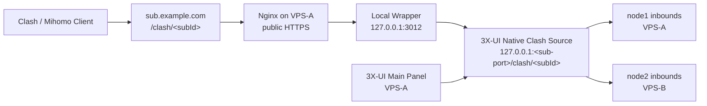
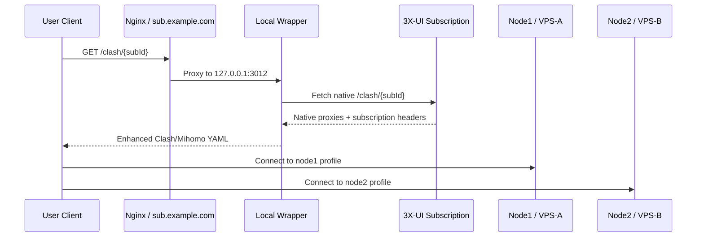
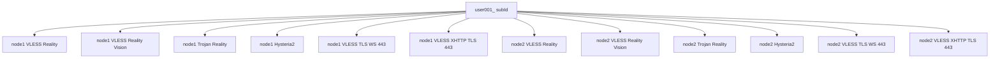
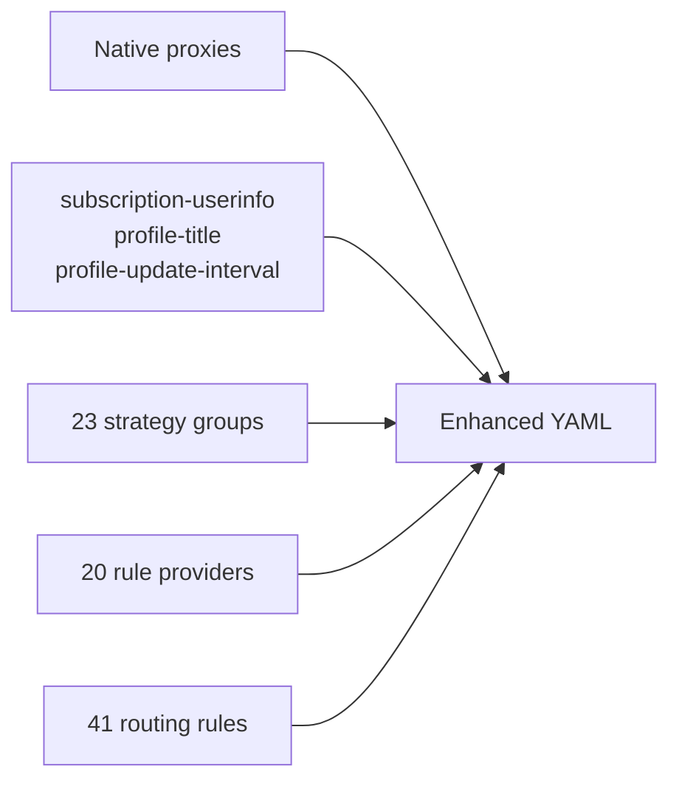

# LinkRay Deploy

> Verified operational skill for the current two-node LinkRay 3X-UI deployment.

LinkRay Deploy documents one deployed system, not a generic VPN template: VPS-A runs the main 3X-UI panel, subscription service, Nginx, local node, and Clash/Mihomo wrapper; VPS-B runs the remote node managed by VPS-A. Users import one wrapper-backed Clash/Mihomo subscription.

```text
Primary user subscription:
https://sub.example.com/clash/<subId>
```

## Visual Overview





## Deployed Shape

| Layer | Verified deployment |
|---|---|
| Main authority | VPS-A 3X-UI panel |
| Remote node | VPS-B 3X-UI node |
| Public handoff | `https://sub.example.com/clash/<subId>` |
| Native diagnostics | `/sub/<subId>`, `/json/<subId>` |
| Subscription profile | Wrapper-backed Clash/Mihomo YAML |
| Profile count | `12` profiles total |
| Rules output | `23` strategy groups, `20` providers, `41` routing rules |

## Domains

| Public name | Role | Cloudflare mode |
|---|---|---|
| `panel.example.com` | 3X-UI admin panel | DNS only during setup |
| `sub.example.com` | Public subscription URL | DNS only or tested proxy mode |
| `direct1.example.com` | node1 direct endpoint | DNS only |
| `direct2.example.com` | node2 direct endpoint | DNS only |
| `node1.example.com` | node1 WS transport | Proxied for WS |
| `node2.example.com` | node2 WS transport | Proxied for WS |
| `xhttp1.example.com` | node1 XHTTP transport | Proxied for XHTTP |
| `xhttp2.example.com` | node2 XHTTP transport | Proxied for XHTTP |

Reality and Hysteria2 stay on VPS IPs or DNS-only hostnames. Cloudflare orange-cloud is used only for HTTP-compatible WS/XHTTP transports.

## Verified Profiles

Each node exposes the same verified profile set:

| Node | Profiles |
|---|---|
| node1 / VPS-A | VLESS Reality, VLESS Reality Vision, Trojan Reality, Hysteria2, VLESS TLS WS 443, VLESS XHTTP TLS 443 |
| node2 / VPS-B | VLESS Reality, VLESS Reality Vision, Trojan Reality, Hysteria2, VLESS TLS WS 443, VLESS XHTTP TLS 443 |

Expected subscription total: `12` profiles.



## Clash/Mihomo Rules

The wrapper keeps 3X-UI as the authority for users, quota, expiry, traffic, nodes, and native subscription data, then returns the full Clash/Mihomo profile.



Visible strategy groups:

```text
自动选择, 故障转移, 负载均衡, 节点选择, 流媒体, 手动切换,
全球代理, DNS_Proxy, Telegram, Google, YouTube, Netflix, Spotify,
HBO, Bing, Microsoft, OpenAI, ClaudeAI, Disney, GitHub,
国内媒体, 本地直连, 漏网之鱼
```

Routing contract:

| Route type | Target |
|---|---|
| DoH domains | `DNS_Proxy` |
| Telegram domain and IP rules | `Telegram` |
| `media-cn` | `国内媒体` |
| China domains and IPs | `本地直连` |
| Overseas geolocation | `全球代理` |
| Final fallback | `MATCH,漏网之鱼` |

## Install Skill

```bash
mkdir -p ~/.codex/skills
cp -R LinkRay-deploy ~/.codex/skills/
```

Invoke it with:

```text
$LinkRay-deploy
```

## Handoff Verification

Run these before handing a subscription to a user:

```bash
systemctl is-active x-ui nginx
ss -tlnp | grep -E ':(443|9444|9445|9446|<local-ws-port>|<local-xhttp-port>) '
ss -lunp | grep -E ':(8444) '

curl -fsS 'https://sub.example.com/clash/<subId>' -o /tmp/linkray.yaml
mihomo -t -f /tmp/linkray.yaml
grep -nE '^(proxy-groups|rule-providers|rules):' /tmp/linkray.yaml
grep -nE '^[[:space:]]*- name: (自动选择|故障转移|负载均衡|节点选择|流媒体|手动切换|全球代理|DNS_Proxy|Telegram|Google|YouTube|Netflix|Spotify|HBO|Bing|Microsoft|OpenAI|ClaudeAI|Disney|GitHub|国内媒体|本地直连|漏网之鱼)$' /tmp/linkray.yaml
```

For live checks, run Mihomo controller delay tests against every exact proxy name. A single GUI green check is not enough evidence.

## Node2 IP Change Checklist

When VPS-B changes IP, update these together:

```text
Cloudflare DNS for direct2/node2/xhttp2
VPS-A main-panel nodes.address
VPS-B share_addr values
VPS-B firewall allow rules for VPS-A
VPS-A Nginx WS/XHTTP upstreams
Wrapper server rewrite map
```

Then re-fetch `/clash/<subId>`, run `mihomo -t`, and run delay checks for every node2 profile.

## Operational Guardrails

- Keep one subscription authority: VPS-A.
- Do not disable subscriptions.
- Do not expose VPS-B panel/API ports publicly.
- Do not rename `x-ui` services, database paths, API paths, or node sync identifiers for branding.
- Do not point Reality or Hysteria2 at Cloudflare orange-cloud hostnames.
- Do not bind Xray directly to public `443/tcp` for WS/XHTTP when Nginx owns 443.
- Keep the wrapper bound to `127.0.0.1`.

## Repository Layout

| Path | Purpose |
|---|---|
| [SKILL.md](SKILL.md) | Agent entrypoint and deployed workflow rules |
| [references/cluster-blueprint.md](references/cluster-blueprint.md) | Command-level deployment and repair blueprint |
| [agents/openai.yaml](agents/openai.yaml) | Display metadata for OpenAI/Codex-style agent surfaces |
| [evals/evals.json](evals/evals.json) | Behavioral expectations for this deployed scope |

## Local Checks

```bash
python3 ~/.codex/skills/readme-generator/scripts/check_readme_refs.py .
git diff --check
```

## Scope

This README intentionally describes the deployment already verified through this skill.
